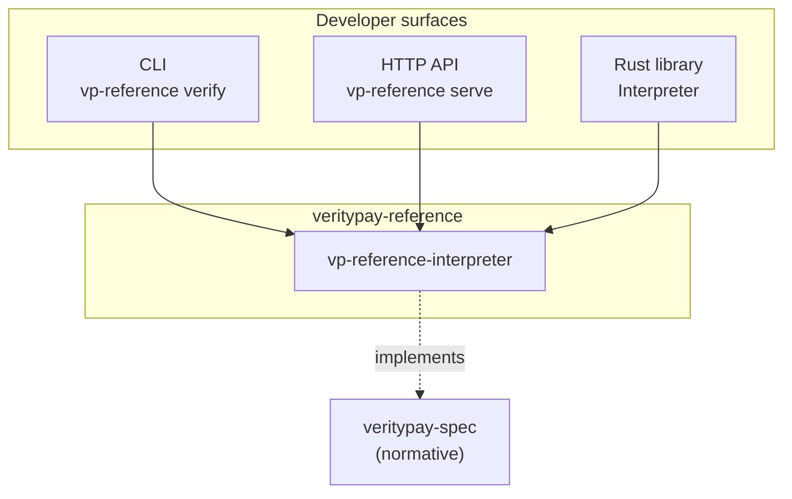
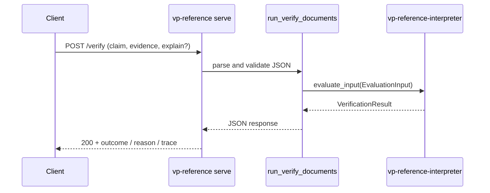
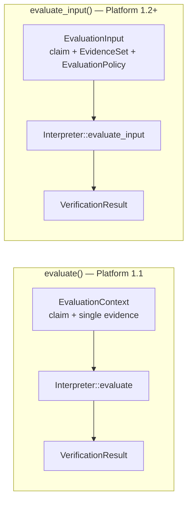
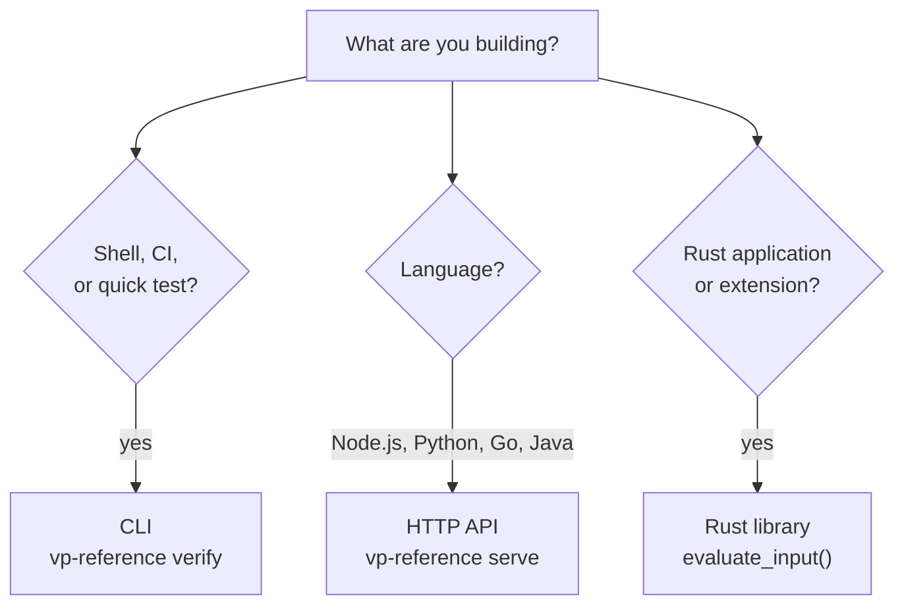
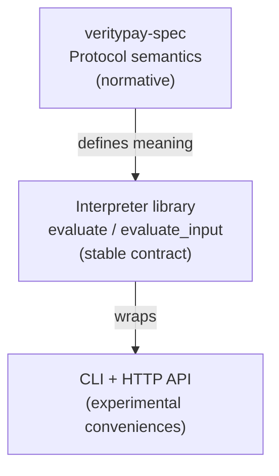
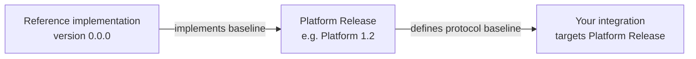
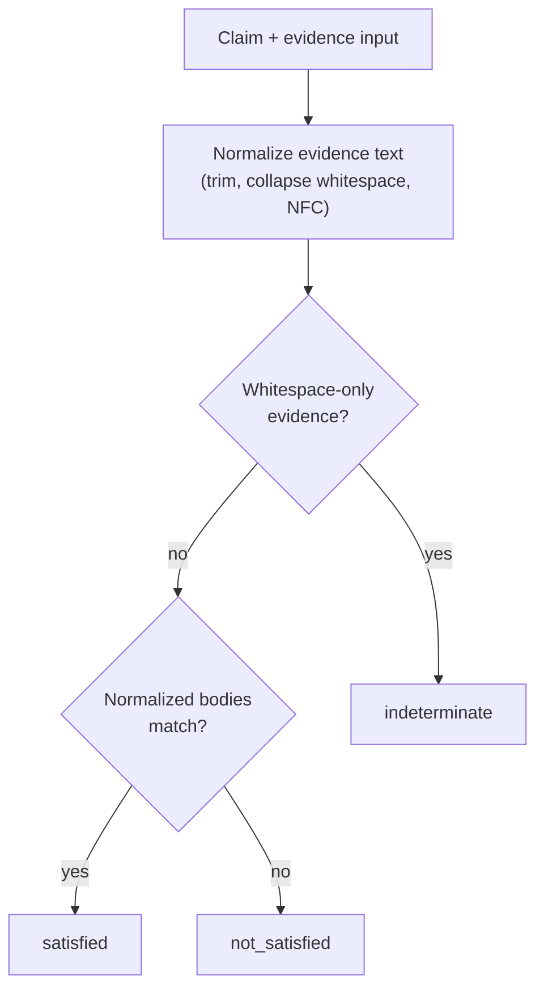
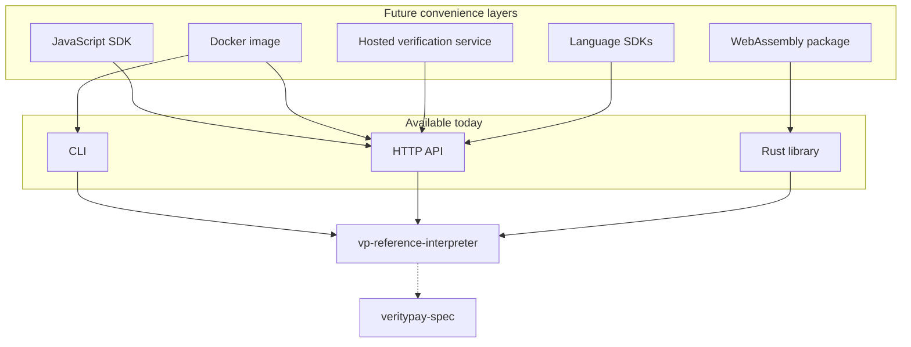

# Developer API

This document describes how developers interact with the **veritypay-reference** implementation.

It is **not** a protocol specification. Protocol semantics are defined only by [`veritypay-spec`](https://github.com/VerityPay-Inc/veritypay-spec). This document covers **developer convenience surfaces** built on top of the reference interpreter.

**Audience:** developers integrating Verity, SDK authors, API consumers, and example application authors.

---

## Integration surfaces

The reference implementation currently exposes three integration surfaces. All three execute the same reference interpreter in `vp-reference-interpreter`:

| Surface | Entry | Best for |
|---------|-------|----------|
| **CLI** | `vp-reference verify` | Shell, CI, demos, quick testing |
| **HTTP API** | `vp-reference serve` | Any language without embedding Rust |
| **Rust library** | `Interpreter::evaluate` / `Interpreter::evaluate_input` | Rust applications, custom harnesses, conformance oracles |



---

## CLI

Build the binary:

```bash
cargo build -p vp-reference-cli
```

### `vp-reference verify`

Verify one claim against one evidence file.

```bash
vp-reference verify \
  --claim <path-to-claim.json> \
  --evidence <path-to-evidence.json> \
  [--format human|json] \
  [--explain]
```

| Argument | Default | Description |
|----------|---------|-------------|
| `--claim` | *(required)* | Path to claim JSON |
| `--evidence` | *(required)* | Path to evidence JSON |
| `--format` | `human` | Output format: `human` or `json` |
| `--explain` | off | Include step-by-step explanation derived from the evaluation trace |

**Exit codes**

| Code | Meaning |
|------|---------|
| `0` | Verification completed (outcome may be `satisfied`, `not_satisfied`, or `indeterminate`) |
| `2` | User error — missing file, invalid JSON, or invalid claim/evidence shape |

### Human output

```bash
cargo run -p vp-reference-cli --bin vp-reference -- verify \
  --claim examples/claim.normalized_text.json \
  --evidence examples/evidence.normalized_text.json \
  --format human
```

```text
✓ satisfied claim-001
Reason: All 1 applicable evidence envelope(s) satisfied (ALL_REQUIRED)
```

With `--explain`:

```text
✓ satisfied claim-001

Assertion type: normalized_text
Evidence: evidence-001
Policy: ALL_REQUIRED

Applied rules:
- VP-RULE-0002
- VP-RULE-0011

Explanation:
1. Evidence claim_id matched claim claim_id.
2. Evidence text was normalized.
3. Normalized assertion body matched normalized evidence body.
4. ALL_REQUIRED aggregation returned satisfied.

Reason:
All 1 applicable evidence envelope(s) satisfied (ALL_REQUIRED)
```

### JSON output

```bash
cargo run -p vp-reference-cli --bin vp-reference -- verify \
  --claim examples/claim.normalized_text.json \
  --evidence examples/evidence.normalized_text.json \
  --format json
```

```json
{
  "claim_id": "claim-001",
  "outcome": "satisfied",
  "reason": "All 1 applicable evidence envelope(s) satisfied (ALL_REQUIRED)",
  "trace": [ "..." ]
}
```

### Intended use

The CLI is intended for:

- **Testing** — manual and scripted verification during development
- **Demos** — showing claim → evidence → outcome without writing integration code
- **Automation** — shell scripts and local tooling
- **CI** — smoke checks that the reference interpreter produces expected outcomes

### Input JSON shapes

**Claim file** — see [`examples/claim.normalized_text.json`](examples/claim.normalized_text.json):

```json
{
  "claim_id": "claim-001",
  "subject": "example-subject",
  "assertion": {
    "assertion_type": "normalized_text",
    "body": "Hello World"
  }
}
```

**Evidence file** — see [`examples/evidence.normalized_text.json`](examples/evidence.normalized_text.json):

```json
{
  "evidence_id": "evidence-001",
  "claim_id": "claim-001",
  "evidence_type": "document",
  "content": {
    "content_type": "text/plain",
    "body": "  Hello   World  "
  }
}
```

---

## HTTP API

### `vp-reference serve`

Expose the verify pipeline over HTTP so any language can integrate without embedding Rust.

```bash
vp-reference serve [--host <host>] [--port <port>]
```

| Argument | Default | Description |
|----------|---------|-------------|
| `--host` | `127.0.0.1` | Listen address |
| `--port` | `8787` | Listen port |

Example:

```bash
cargo run -p vp-reference-cli --bin vp-reference -- serve --host 127.0.0.1 --port 8787
```

### `GET /health`

Liveness check.

**Response** — `200 OK`

```json
{
  "status": "ok",
  "service": "vp-reference",
  "version": "platform-1.3-dev"
}
```

```bash
curl -s http://127.0.0.1:8787/health
```

### `POST /verify`

Run verification for one claim and one evidence object.

**Request** — `Content-Type: application/json`

```json
{
  "claim": {
    "claim_id": "claim-001",
    "subject": "example-subject",
    "assertion": {
      "assertion_type": "normalized_text",
      "body": "Hello World"
    }
  },
  "evidence": {
    "evidence_id": "evidence-001",
    "claim_id": "claim-001",
    "evidence_type": "document",
    "content": {
      "content_type": "text/plain",
      "body": "  Hello   World  "
    }
  },
  "explain": false
}
```

| Field | Required | Default | Description |
|-------|----------|---------|-------------|
| `claim` | yes | — | Same shape as CLI claim file |
| `evidence` | yes | — | Same shape as CLI evidence file |
| `explain` | no | `false` | When `true`, response matches `verify --format json --explain` |

**Response** — `200 OK`

Same JSON shape as `vp-reference verify --format json [--explain]`. See [Examples](#examples).

**Error response body**

```json
{
  "error": "description of the problem"
}
```

### HTTP status codes

| Status | Meaning |
|--------|---------|
| `200` | Verification completed successfully |
| `400` | Malformed request — invalid JSON, missing fields, or invalid claim/evidence shape |
| `500` | Internal server error — unexpected failure during request handling |

Bind failures surface when the server process starts, not as `500` on individual requests.

```bash
curl -s http://127.0.0.1:8787/verify \
  -H 'content-type: application/json' \
  -d '{
    "claim": {
      "claim_id": "claim-001",
      "subject": "example-subject",
      "assertion": {
        "assertion_type": "normalized_text",
        "body": "Hello World"
      }
    },
    "evidence": {
      "evidence_id": "evidence-001",
      "claim_id": "claim-001",
      "evidence_type": "document",
      "content": {
        "content_type": "text/plain",
        "body": "  Hello   World  "
      }
    },
    "explain": true
  }'
```

The HTTP handler reuses the same verify pipeline and JSON renderer as the CLI. Interpreter logic is not duplicated in the server layer.



---

## Rust Library API

For embedders and Rust applications, use the interpreter crates directly.

| Crate | Role |
|-------|------|
| `vp-reference-model` | Domain types: `Claim`, `Evidence`, `Outcome`, `VerificationResult` |
| `vp-reference-core` | `EvaluationContext`, `EvaluationInput`, `SpecificationContext` |
| `vp-reference-interpreter` | `Interpreter` — executes rules and returns `VerificationResult` |



### `Interpreter::evaluate()`

`EvaluationContext` → `Interpreter::evaluate` → `VerificationResult`

| Property | Detail |
|----------|--------|
| **Platform** | 1.1 compatibility path |
| **Evidence** | Single evidence envelope |
| **Contract** | Stable public contract per [ADR-0007](docs/adrs/0007-reference-interpreter-public-contract.md) |
| **Use when** | Simple single-evidence integrations, conformance oracle paths that build `EvaluationContext` per envelope |

**Inputs:** `EvaluationContext` with `specification`, `claim`, `evidence`, and `options`.

### `Interpreter::evaluate_input()`

`EvaluationInput` → `Interpreter::evaluate_input` → `VerificationResult`

| Property | Detail |
|----------|--------|
| **Platform** | 1.2 and later |
| **Evidence** | `EvidenceSet` — zero or more envelopes |
| **Policy** | `EvaluationPolicy` — today `ALL_REQUIRED` per [VP-RFC-0004](https://github.com/VerityPay-Inc/veritypay-spec/blob/main/rfcs/0004-evidence-evaluation-policies.md) |
| **Use when** | New integrations, multi-evidence evaluation, matching CLI/HTTP behavior |

**Inputs:** `EvaluationInput` with `specification`, `claim`, `evidence_set`, `evaluation_policy`, and `options`.

**Recommendation:** use `evaluate_input()` for new integrations. It is the future-proof entrypoint and matches what the CLI and HTTP API use internally.

Both entrypoints dispatch by `assertion_type` through the assertion evaluator registry ([ADR-0009](docs/adrs/0009-assertion-evaluator-architecture.md)). Outcome vocabulary is always `satisfied`, `not_satisfied`, or `indeterminate`.

---

## Choosing an Interface

| Use case | Interface |
|----------|-----------|
| CLI | CLI |
| CI | CLI |
| Shell scripts | CLI |
| Testing | CLI |
| Node.js | HTTP |
| Python | HTTP |
| Go | HTTP |
| Java | HTTP |
| Rust application | Library |
| Reference implementation extensions | Library |



---

## Stability

Protocol semantics are defined **only** by [`veritypay-spec`](https://github.com/VerityPay-Inc/veritypay-spec).

The reference implementation **follows** the specification. It does **not** define protocol meaning.

| Surface | Stability |
|---------|-----------|
| **Protocol outcomes and rules** | Governed by accepted RFCs in `veritypay-spec` |
| **Interpreter library** (`evaluate`, `evaluate_input`) | Stable contract per [ADR-0007](docs/adrs/0007-reference-interpreter-public-contract.md) |
| **CLI and HTTP API** | **Experimental** — flags, paths, and JSON convenience fields may evolve |

CLI, HTTP API, and library APIs are developer conveniences. They may evolve independently **provided protocol semantics remain unchanged**.

Reference implementation behavior **must** always trace back to accepted RFCs. When this repository and the specification disagree, **the specification wins**.



---

## Compatibility

**Platform Releases** determine protocol compatibility. See [PLATFORM_RELEASES.md](https://github.com/VerityPay-Inc/veritypay-spec/blob/main/PLATFORM_RELEASES.md) in `veritypay-spec`.

| Concept | Meaning |
|---------|---------|
| **Platform Release** | A named protocol capability baseline (for example Platform 1.2, Platform 1.3) |
| **Reference implementation version** | This repository's implementation version (`0.0.0` workspace version today) |

Developers should target **Platform Releases**, not repository commit hashes, when declaring what protocol behavior they depend on.



Current reference implementation coverage:

| Platform | Assertion types | Notes |
|----------|-----------------|-------|
| **1.1** | `body_equality`, `minimal` | **VP-RULE-0001**, **VP-RULE-0002** |
| **1.2** | Same as 1.1 | + `EvidenceSet`, `ALL_REQUIRED` via `evaluate_input` |
| **1.3** *(in progress)* | + `normalized_text` | **VP-RULE-0011** per draft [VP-RFC-0011](https://github.com/VerityPay-Inc/veritypay-spec/blob/main/rfcs/0011-normalized-text-assertion.md) |

---

## Examples

All examples use `assertion_type: "normalized_text"` evaluated by **VP-RULE-0011** (draft [VP-RFC-0011](https://github.com/VerityPay-Inc/veritypay-spec/blob/main/rfcs/0011-normalized-text-assertion.md)).



### Satisfied

Trim and internal whitespace collapse produce matching normalized bodies.

**Inputs** — reuse [`examples/claim.normalized_text.json`](examples/claim.normalized_text.json) and [`examples/evidence.normalized_text.json`](examples/evidence.normalized_text.json):

- Claim body: `"Hello World"`
- Evidence body: `"  Hello   World  "`

```bash
vp-reference verify \
  --claim examples/claim.normalized_text.json \
  --evidence examples/evidence.normalized_text.json \
  --format json
```

**Output:**

```json
{
  "claim_id": "claim-001",
  "outcome": "satisfied",
  "reason": "All 1 applicable evidence envelope(s) satisfied (ALL_REQUIRED)",
  "trace": [ "..." ]
}
```

### Not satisfied

Case-sensitive comparison — `Hello` and `hello` do not match after normalization.

**Request:**

```json
{
  "claim": {
    "claim_id": "claim-001",
    "subject": "example-subject",
    "assertion": {
      "assertion_type": "normalized_text",
      "body": "Hello"
    }
  },
  "evidence": {
    "evidence_id": "evidence-001",
    "claim_id": "claim-001",
    "evidence_type": "document",
    "content": {
      "content_type": "text/plain",
      "body": "hello"
    }
  }
}
```

**Output:**

```json
{
  "claim_id": "claim-001",
  "outcome": "not_satisfied",
  "reason": "At least one applicable evidence envelope is not_satisfied (ALL_REQUIRED)",
  "trace": [ "..." ]
}
```

### Indeterminate

Whitespace-only evidence is indeterminate before normalized comparison proceeds.

**Request:**

```json
{
  "claim": {
    "claim_id": "claim-001",
    "subject": "example-subject",
    "assertion": {
      "assertion_type": "normalized_text",
      "body": "Hello"
    }
  },
  "evidence": {
    "evidence_id": "evidence-001",
    "claim_id": "claim-001",
    "evidence_type": "document",
    "content": {
      "content_type": "text/plain",
      "body": "     "
    }
  }
}
```

**Output:**

```json
{
  "claim_id": "claim-001",
  "outcome": "indeterminate",
  "reason": "At least one applicable evidence envelope is indeterminate with no not_satisfied (ALL_REQUIRED)",
  "trace": [ "..." ]
}
```

With `"explain": true` or `--explain`, responses also include `assertion_type`, `evidence`, `policy`, `applied_rules`, and `explanation`. Explanation text is informative only — not normative protocol objects.

---

## Future Interfaces

Future developer interfaces may include:

- **JavaScript SDK**
- **WebAssembly package**
- **Docker image**
- **Hosted verification service**
- **Language SDKs** (Python, Go, Java, and others)

These would be convenience layers over the same reference interpreter documented here. They do not change protocol semantics defined in `veritypay-spec`.



---

## Related documents

| Document | Role |
|----------|------|
| [README.md](README.md) | Repository overview |
| [PLATFORM_RELEASES.md](https://github.com/VerityPay-Inc/veritypay-spec/blob/main/PLATFORM_RELEASES.md) | Platform compatibility baselines |
| [ADR-0007](docs/adrs/0007-reference-interpreter-public-contract.md) | Stable interpreter contract |
| [ADR-0009](docs/adrs/0009-assertion-evaluator-architecture.md) | Assertion type dispatch |
| [CONFORMANCE_MODEL.md](https://github.com/VerityPay-Inc/veritypay-spec/blob/main/docs/03-development/CONFORMANCE_MODEL.md) | VP-CS and oracle expectations |
| [examples/](examples/) | Sample claim and evidence JSON files |
